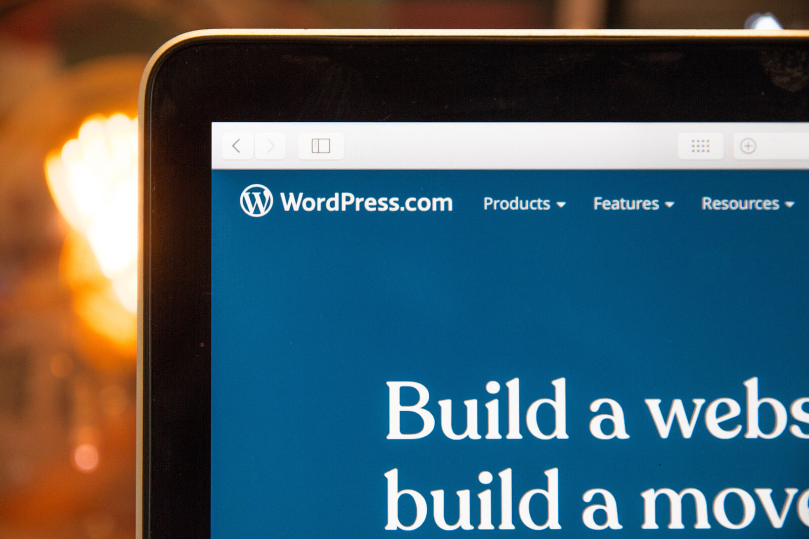

드디어 가츠비로 블로그를 만들어서 글을 작성해봅니다. Nextjs로 만들때는 하나하나가 힘들었는데, 그새 짬이 생겨서 이것도 편해졌네요.

가장 마음에 드는 점은 이미지 출력 부분입니다.

제가 예전부터 Medium의 이미지 팝업(확대) 기능을 좋아했는데요. 이 블로그 테마에서 쉽게 구현이 가능합니다.

  

위 사진을 클릭하면 확대됩니다. 정말 부드럽고 유연하게 확대가 됩니다.

그리고 오른쪽 위에 달모양을 클릭하면 블랙테마로 변경됩니다. 요새 OLED 디스플레이가 많은데, 전력효율에 큰 도움이 될 것입니다.

아직 태그와 카테고리 쪽은 구현이 안되었지만 몇달 지나면 구현될 것 같습니다.

큰 기대가 됩니다!